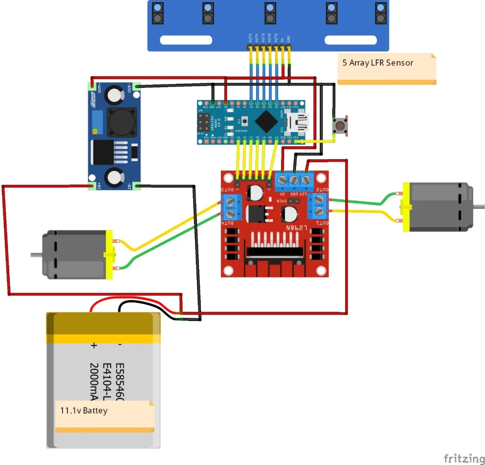
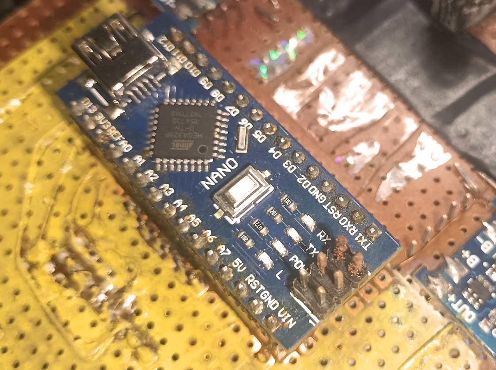

# Line Follower

A **PID (Proportional, Integral, Derivative) line following robot** is an autonomous vehicle that uses a closed-loop feedback system to track a line smoothly and at high speeds. Unlike basic "bang-bang" controllers that abruptly twitch left or right, PID allows for graduated steering adjustments based on the robot's exact distance from the line.

## How the PID Algorithm Works

The controller calculates steering adjustments using three mathematical components:

* **Proportional (P):** Steers the robot in proportion to its current distance (Error) from the line. The further the robot drifts, the more aggressively it turns back.
* **Integral (I):** Corrects small, persistent errors over time by accumulating past errors. This prevents long-term drift but can sometimes cause instability if overused.
* **Derivative (D):** Anticipates future errors by measuring the rate of change. It acts as a damper to prevent the robot from overshooting the line and wobbling.

## Core Components Needed

To build a high-performance PID line follower, you will need the following hardware:

* **Microcontroller:** Arduino Nano, Arduino Uno, or an ESP32 for faster processing.
* **Sensor Array:** A 5-channel to 8-channel QTR reflectance sensor array (e.g., Pololu QTR-8A or homemade TCRT5000 array) is standard.
* **Motors:** High-RPM, 300 to 1000 RPM Micro Metal Gear Motors (N20).
* **Motor Driver:** Pololu DRV8835, TB6612FNG, or L298N to control motor speed and direction.
* **Power Supply:** A 2S LiPo battery (7.4V) for consistent, sag-free power compared to alkaline AA batteries.

## Creation of bot

For a deep dive into

* circuit design

* soldering

* assembly of a competitive PID

## Tuning the PID Controller

Every robot behaves differently based on motor speed, wheel grip, and sensor height.
> Tuning is best done systematically:

1. **Start with P-Only:** Set \(K_{i}\) and \(K_{d}\) to zero. Gradually increase \(K_{p}\) until the robot begins to rapidly wobble on a straight line, then back off the value by 20-30%.
2. **Add D-Control:** Introduce a Derivative value (\(K_{d}\)). Slowly increase this until the aggressive side-to-side oscillation stops and the robot navigates curves smoothly.
3. **Add I-Control (Optional):** If the robot drifts on long straightaways, apply a very small Integral value (\(K_{i}\)).

### Practical Code Structure

In your microcontroller's loop function, the logic typically follows this sequence:

1. **Read Sensors:** Take calibrated, weighted average readings from the sensor array.
2. **Calculate Error:** Subtract the target position (usually the center sensor) from the current line position.
3. **Compute PID:** Use the formula:
   \(PID\_Value = (K_p \times Error) + (K_i \times Integral) + (K_d \times Derivative)\)
4. **Drive Motors:** Adjust motor speeds differentially.

* **Left Motor Speed =**\(Base\_Speed - PID\_Value\)
* **Right Motor Speed =**\(Base\_Speed + PID\_Value\)

## Code for Arduino PID Line Follower

[Line Follower](https://github.com/singhpriansh/pid_LF/blob/master/LFcode.ino)
